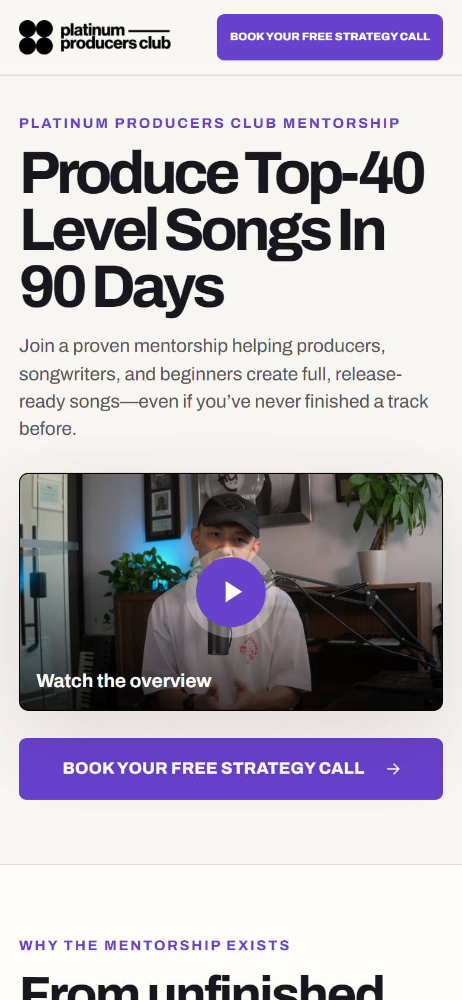

# Platinum Producers Club funnel preview



A focused, static two-page funnel for the Platinum Producers Club music-production mentorship operated by Terence Lam / PROMU Music Group Ltd.

Status: isolated GitHub Pages preview. The production website, DNS, Calendly account, redirects, and tracking remain untouched.

- [Sales-page preview](https://jlsp124.github.io/platinum-producers-club/)
- [Thank-you-page preview](https://jlsp124.github.io/platinum-producers-club/thankyou/)
- [Public repository](https://github.com/jlsp124/platinum-producers-club)

## Funnel

The public flow is intentionally split by visitor state:

1. `/` — one promise, current VSL, three value points, selected student proof, concise fit, and one Calendly action.
2. Calendly — `https://calendly.com/terence-p-lam/release-ready-strategy-call`.
3. `/thankyou/` — booking confirmation, current pre-call video, concise Terence biography, and three preparation items.

The homepage no longer carries Terence’s biography, a four-step methodology, detailed call mechanics, an FAQ, or repeated qualification/feature copy. The historical `/mentor1` and `/mentor2` funnels remain audit references only; current messaging comes from `/release-ready_bio` and the current `/thankyou` page.

## Local development and QA

Requirements: Node.js 22.12 or newer and npm.

```powershell
npm ci
npm run dev
npm run qa
npm run screenshots
```

`npm run qa` builds static HTML, validates it, and runs Playwright/axe across 320, 375, 390, 430, 768, 1024, 1440, and 1728 CSS pixels. Both funnel routes are covered at every width.

## Architecture

- Astro static output and GitHub Pages deployment
- TypeScript for small progressive enhancements
- Plain CSS and a locally served Archivo variable font
- Click-to-load current Vimeo VSL and pre-call video
- Three click-to-load current Testimonial.to/Mux student videos
- Direct semantic Calendly links with supported UTM forwarding
- No backend, form, CMS, scheduler embed, UI framework, carousel, or client-side router
- Preview `noindex,nofollow,noarchive`, production canonical metadata, and repository-base-path validation

## Calendly boundary

The repository does not modify Calendly. During an approved production migration, Terence should configure the Release Ready Strategy Call confirmation behavior to redirect successful invitees to:

`https://platinumproducersclub.com/thankyou`

Exact owner steps and test requirements are in [docs/production-migration-checklist.md](docs/production-migration-checklist.md).

## Documentation

- [Current authoritative content and media](docs/current-authoritative-content.md)
- [Information architecture](docs/information-architecture.md)
- [Current-site audit](docs/current-site-audit.md)
- [Reference analysis](docs/reference-sales-page-analysis.md)
- [Design system](docs/design-system.md)
- [Testing and performance](docs/testing-and-performance.md)
- [Production migration checklist](docs/production-migration-checklist.md)
- [Content needing owner/legal verification](docs/content-needing-owner-verification.md)
- [Third-party licenses and asset provenance](docs/third-party-licenses.md)

## Production boundary

Pushing this repository updates only the GitHub Pages preview. Do not enable production indexing, add a custom domain, change DNS, configure Calendly, copy tracking IDs, or retire the old funnel without explicit owner approval and end-to-end migration QA.
