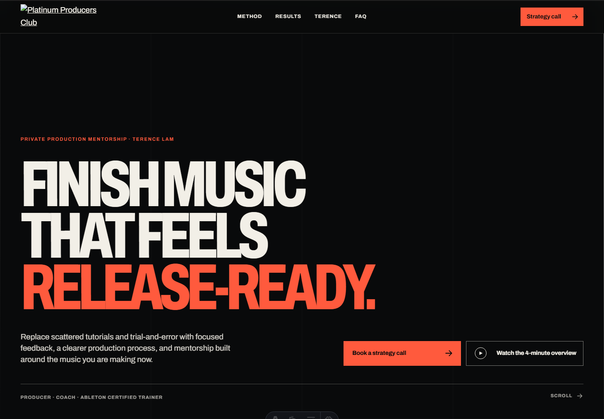

# Platinum Producers Club redesign



A portfolio-quality static redesign of the Platinum Producers Club music-production coaching funnel operated by Terence Lam / PROMU Music Group Ltd.

Status: independent public preview. The current production website, production DNS, existing Calendly event, and current funnel service remain separate and untouched.

## Purpose

The site replaces a generic funnel-builder presentation with a fast, accessible, editorial experience focused on one conversion: helping a suitable producer reach Terence’s existing Release Ready Strategy Call in Calendly.

It does not rebuild scheduling, reminders, time-zone handling, meeting links, CRM behavior, or payments.

## Local development

Requirements: Node.js 22.12 or newer and npm.

```powershell
npm ci
npm run dev
```

Open `http://localhost:4321/`.

## Build and QA

```powershell
npm run build
npm run qa
npm run screenshots
```

`npm run qa` builds the static site, validates generated HTML, and runs the responsive Playwright/axe suite. The full evidence and current Lighthouse measurements are in [docs/testing-and-performance.md](docs/testing-and-performance.md).

## Architecture

- Astro static output
- TypeScript for the small progressively enhanced interaction layer
- Plain CSS with a custom 12-column editorial system
- Locally served Archivo variable font
- Sharp/Astro responsive AVIF and WebP generation
- Native `<dialog>`, `<details>`, semantic links, and IntersectionObserver
- No backend, database, CMS, UI framework, or client-side router
- No analytics in the preview

The Vimeo player is lazy-created only after a visitor asks to watch it. All CTA links work without JavaScript.

## Calendly integration

The canonical destination is:

`https://calendly.com/terence-p-lam/release-ready-strategy-call`

All major CTAs are normal same-tab links to that event. The interaction script forwards only `utm_source`, `utm_medium`, `utm_campaign`, `utm_content`, and `utm_term` when present. It does not imitate or alter Calendly.

## Preview and SEO modes

The default build is a preview build:

- canonical metadata points to `https://platinumproducersclub.com/`;
- meta robots is `noindex,nofollow,noarchive`;
- `robots.txt` disallows crawling;
- the current production domain remains authoritative.

Production indexing is deliberately gated behind `PUBLIC_SITE_MODE=production` and the approved migration checklist. Do not set it for the GitHub Pages preview.

## GitHub Pages deployment

`.github/workflows/pages.yml` validates the project, builds with `BASE_PATH=/<repository>`, checks local paths/noindex, uploads the static artifact, and deploys through GitHub Pages on every push to `main`.

The workflow does not create a custom domain, write a `CNAME`, or touch production DNS.

## Directory structure

```text
src/
  assets/source/       Owner/business source assets retained locally
  components/          Header, footer, CTA, video-dialog primitives
  data/                Stable site/Calendly constants
  layouts/             Shared metadata and page shell
  pages/               Homepage, legal routes, robots, sitemap, 404
  scripts/             Progressive enhancement
  styles/              Design system and responsive implementation
docs/                  Audit, strategy, verification, QA, migration notes
scripts/               Build-time assets, screenshots, Pages validation
tests/                 Playwright and axe critical-flow suite
public/                Generated social/favicons and Pages marker
```

## Documentation

- [Current-site audit](docs/current-site-audit.md)
- [Information architecture](docs/information-architecture.md)
- [Redesign rationale](docs/redesign-rationale.md)
- [Design system](docs/design-system.md)
- [Testing and performance](docs/testing-and-performance.md)
- [Tracking migration](docs/tracking-migration.md)
- [Content needing owner verification](docs/content-needing-owner-verification.md)
- [Assets requested from Terence](docs/assets-needed-from-terence.md)
- [Production migration checklist](docs/production-migration-checklist.md)
- [Third-party licenses and asset provenance](docs/third-party-licenses.md)

## Production launch boundary

This repository is not authorization to migrate production. Before any custom-domain or service change, Terence must approve the design/copy/assets, legal and tracking requirements must be confirmed, the full Calendly booking must be tested with permission, current DNS and platform content must be backed up, redirects must be planned, and rollback must remain available.

Only after a successful migration and rollback window should Terence consider cancelling the existing approximately $100/month website service. No saving is promised before that verification.
